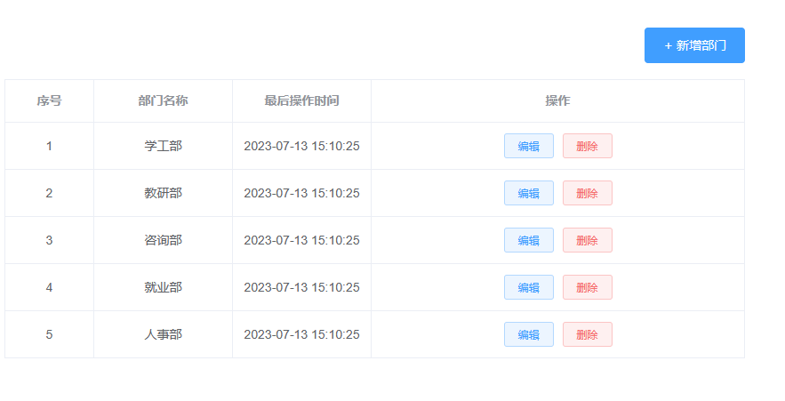
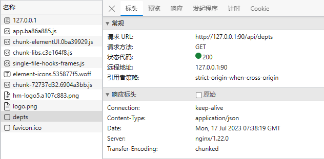

本小节主要讨论部门管理的其他需求的实现, 在引入 nginxTlias 前端工程后, 双击 ngix, 前端项目部署完成, 访问 http://127.0.0.1:90/ 就可以看到页面. 此时假定 MyTlias 后端已经启动, 可以发现 部门管理下已经可以显示查询的数据了:

同时打开开发者工具, 可以看到请求响应是成功的:

这实际上就算是完成了前后端联调的工作, 此后在前端进行的操作就能够传递给后端, 后端据此做出的响应也能返回给前端并以特定方式呈现. 在这个过程中, 前端项目和后端项目本身是完全分离的, 它们仅仅是遵循了同一份api文档, 最后仍能很简单的无差错的融合在一起。

**项目日志工具**
lombok 有一个 logger 工具, 为 `DeptController` 类添加 `@Slf4j`注解, 即可在函数里直接使用:
```log
log.info("some information about some variable: {}", variable);
```

**insert, update, delete**返回值
insert: 插入n条记录, 返回影响行数n. (n>=0)
update: 更新n条记录, 返回影响行数n. (n>=0)
delete: 删除n条记录, 返回影响行数n. (n>=0)

**restful风格**
RESTful风格是一种基于HTTP协议设计Web API的软件架构风格，由Roy Fielding在2000年提出。它强调使用HTTP动词来表示对资源的操作（GET、POST、PUT、PATCH、DELETE等），并通过URI表示资源的唯一标识符。

RESTful API的设计遵循以下几个原则：
1. 基于资源：将数据和功能抽象成资源，并通过URI来唯一标识资源。例如，一个用户资源可以通过URL“/users/{id}”来访问，其中“{id}”表示该用户的唯一标识符。
2. 使用HTTP动词：**使用HTTP动词来表示对资源的操作**, 例如`@GetMapping`:GET(获取资源), `@PostMapping`:POST(创建资源), `@PutMapping`:PUT(更新资源), `@DeleteMapping`: DELETE(删除资源)等。
3. 无状态：每个请求都包含足够的信息来完成请求，服务器不需要保存任何上下文信息。
4. 统一接口：使用统一的接口来简化客户端与服务器之间的交互，包括资源标识符、资源操作和响应消息的格式。
5. 可缓存性：客户端可以缓存响应，以提高性能和减少网络流量。
6. 分层系统：将系统分为多个层次，每个层次处理特定的功能。
RESTful风格的API设计具有良好的可读性、易用性和可扩展性，广泛应用于Web应用程序和移动应用程序的API设计中。

注意, **需要仔细查看 api 接口文档, 明确请求参数和响应数据的格式**

## 新建部门信息
点击新建, 输入名称, 接着点击确定, 会为 dept 表新增一条数据, 请求数据封装在 Department 类中(@Requestbody), 因此在`DeptController`类中添加方法:
```java
@PostMapping("/depts")
public Result add(@RequestBody Department department){
    log.info("新增 {} 部门", department.getName());
    deptService.add(department);
    return Result.success();
}
```
再在 `DeptService` 接口声明方法:
```java
void add(Department department);
```
接着在 `DeptServiceImpl` 类中实现该方法, 注意补充属性值:
```java
@Override
public void add(Department department) {
    department.setCreateTime(LocalDateTime.now());
    department.setUpdateTime(LocalDateTime.now());
    deptMapper.add(department);
}
```
接着在 `DeptMapper` 接口声明方法并书写 MySQL 语句:
```java
@Insert("insert into dept(name, create_time, update_time) values (#{name}, #{createTime}, #{updateTime})")
void add(Department department);
```
至此, 一个完整的 insert 流程就写完了, 可以看到这个过程是自顶向下的, 运行项目
### api 测试
打开 apifox, 新建接口, 命名为 add department, 请求方式设为 POST, 请求路径设为 localhost:8080/depts, 请求参数格式为json, 请求内容:
```json
{
    "name": "开发部"
}
```
表示新增一个开发部, 点击发送请求, 查看响应结果同时刷新数据表查看是否成功插入
### 联调
运行前端工程, 可以看到此时部门页面的所有部门信息已经查询出来, 且包含开发部, 此时可以点击新建按钮并检查是否可以正确新增部门

## 删除部门信息
点击删除, 随后依据 id 进行 delete 操作, 在`DeptController`类中添加方法:
```java
@DeleteMapping("/depts/{id}")
public Result deleteDeptByID(@PathVariable Integer id){
    log.info("删除id为{}的部门", id);
    deptService.deleteDeptByID(id);
    return Result.success();
}
```
再在 `DeptService` 接口声明方法:
```java
void deleteDeptByID(Integer id);
```
接着在 `DeptServiceImpl` 类中实现该方法:
```java
@Override
public void deleteDeptByID(Integer id) {
    deptMapper.deleteDeptByID(id);
}
```
接着在 `DeptMapper` 接口声明方法并书写 MySQL 语句:
```java
@Delete("delete from dept where id=#{id}")
void deleteDeptByID(Integer id);
```
至此, 一个完整的 delete 流程就写完了, 此后再进行api测试和前后端联调, 删除刚刚新增的数据, 查看是否成功.

## 修改部门信息
点击编辑, 随后依据 id 进行 update 操作, 注意它分为了两步, 第一步发出get请求: `/depts/{id}`, 获取到当前待修改的 department.

接着将新的name设置到 department, 接着以新的 department 作为请求参数发出 PUT 请求, 因此在`DeptController`类中添加两个方法:
```java
 @GetMapping("depts/{id}")
public Result getDeptByID(@PathVariable Integer id){
    log.info("获取id={}的部门信息", id);
    Department department = deptService.getDeptByID(id);
    return Result.success(department);
}

@PutMapping("/depts")
public Result update(@RequestBody Department department){
    log.info("更新{}的部门信息", department);
    deptService.update(department);
    return Result.success();
}
```
再在 `DeptService` 接口声明方法:
```java
Department getDeptByID(Integer id);
void update(Department department);
```
接着在 `DeptServiceImpl` 类中实现该方法:
```java
@Override
public Department getDeptByID(Integer id) {
    return deptMapper.getDeptByID(id);
}
@Override
public void update(Department department) {
    department.setUpdateTime(LocalDateTime.now());
    deptMapper.update(department);
}
```
接着在 `DeptMapper` 接口声明方法并书写 MySQL 语句:
```java
@Select("select id, name, create_time, update_time from dept where id = #{id}")
Department getDeptByID(Integer id);
// 注意这里使用动态 mysql 写在 xml 文件
void update(Department department);
```
update dao 接口在这里其实也可以静态实现, 因为这里传入的 department 的未修改字段并不是 null, 而是查询出的原始值.然而, 很多情况可以省略第一次的查询操作, 那么这时就必须使用动态SQL了.

**在 srdc/main/resource 目录下新建 com/example/mytlias/mapper 包文件夹**, 新建 DeptMapper.xml, 接着写入以下内容
```xml
<?xml version="1.0" encoding="UTF-8" ?>
<!DOCTYPE mapper
        PUBLIC "-//mybatis.org//DTD Mapper 3.0//EN"
        "http://mybatis.org/dtd/mybatis-3-mapper.dtd">
<!-- 以下映射可以自定义 -->
<mapper namespace="com.example.mytlias.mapper.DeptMapper">
    <update id="update">
        update dept
        <set>
            <if test="name != null">name = #{name}, </if>
            <if test="createTime != null">create_time = #{createTime}, </if>
            <if test="updateTime != null">update_time = #{updateTime}</if>
        </set>
        where id = #{id}
    </update>
</mapper>
```
注意, 如果出现了无法绑定的异常, 请检查:
1. xml 所在的包文件夹是否与 mapper 所在的包文件夹完全一致, 注意检查拼写错误;
2. xml 文件命名是否与 mapper 文件名一致, 注意检查拼写错误;
3. xml 文件内容中的 namespace 包库是否与 mapper 的包名一致, 可以直接复制, 防止拼写错误;
4. xml 文件内容中的 id 是否与 mapper 的 某一函数对应

最后进行api测试和前后端联调
