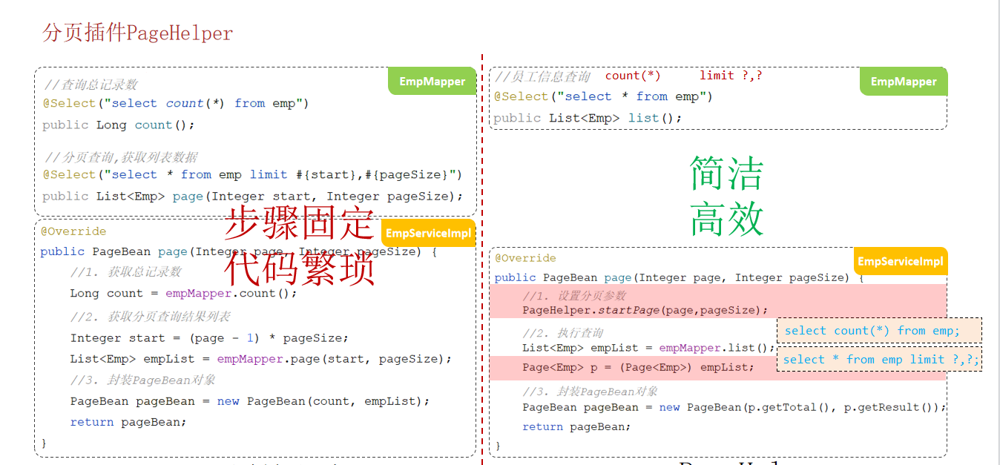

前两节分别完成了搭建系统整体框架和完善部门管理功能的工作, 这一节则完整的实现员工管理中**条件分页查询**的功能. 同样的, 需要**依据 api 接口文档进行开发**.

## 1. 分页条件查询
**请求参数分析**
首先必然是要 动态SQL 支持的, 其次对于查询的参数, 包含了分页参数, 例如 page(页码) 和 pageSize (每页显示数据条数), 还有一些其他参数:

参数名称|是否必须|示例|备注
:-|:-|:-|:-|
name |否| 张| 姓名|
gender| 否| 1 |性别 , 1 男 , 2 女
begin| 否|2010-01-01|范围匹配的开始时间(入职日期)
end| 否|2020-01-01|范围匹配的结束时间(入职日期)
page| 是 |1 |分页查询的页码，如果未指定，默认为1
pageSize| 是 |10|分页查询的每页记录数，如果未指定，默认为10

请求示例:
```js
/emps?name=张&gender=1&begin=2007-09-01&end=2022-09-01&page=1&pageSize=10
```
**返回data分析**
total: 总记录条数
rows: 查询得到的 Employee 列表
需要 `PageBean` 实体封装这两个对象

### 分页查询
先按常规思路实现分页查询, 此时只考虑请求参数中的 page 和 pageSize , 并为它们设置默认值:
```Java
@Slf4j
@RestController
public class EmpController {
    @Autowired
    private EmpService empService;
    // 1. 分页查询
    // 需求参数: page=1, pageSize=10, 注意这里规定了默认值
    @GetMapping("/emps")
    public Result queryPage(
            @RequestParam(defaultValue = "1") Integer page,
            @RequestParam(defaultValue = "10") Integer pageSize){
        log.info("查询第{}页一共(可能不到){}条数据", page, pageSize);
        PageBean pageBean = empService.queryPage(page, pageSize);
        return Result.success(pageBean);
    }
}
```
使用到了 ` @RequestParam(defaultValue = "1")` 注解
其中 `pageBean` 定义如下:
```java
@NoArgsConstructor
@AllArgsConstructor
@Data
public class PageBean {
    Integer total;  // 查询得到的记录条数
    List<Employee> rows;    // 查询结果
}
```
为 `empService` 添加方法:
```java
public interface EmpService {
    PageBean queryPage(Integer page, Integer pageSize);
}
```
实现该方法, 需要两个sql查询, 不妨均放在 xml 中:
```java
@Service
public class EmpServiceImpl implements EmpService {
    @Autowired
    EmpMapper empMapper;

    @Override
    public PageBean queryPage(Integer page, Integer pageSize) {
        // 1. 查询当页数据, 先计算好起始记录号
        Integer start = (page-1) * pageSize;
        List<Employee> employeePageList = empMapper.queryPage(start, pageSize);
        // 2. 查询所有(符合条件)的记录数
        int totalNum = empMapper.queryRecNum();
        return new PageBean(totalNum, employeePageList);
    }
}
```
xml 文件命名为 EmpMapper.xml, 与 EmpMapper 同目录, 内容目前为:
```xml
<?xml version="1.0" encoding="UTF-8" ?>
<!DOCTYPE mapper
        PUBLIC "-//mybatis.org//DTD Mapper 3.0//EN"
        "http://mybatis.org/dtd/mybatis-3-mapper.dtd">
<!-- 以下映射可以自定义 -->
<mapper namespace="com.example.mytlias.mapper.EmpMapper">
    <select id="queryPage" resultType="com.example.mytlias.pojo.Employee">
        select * from emp limit #{start}, #{pageSize}
    </select>
    <select id="queryRecNum" resultType="java.lang.Integer">
        select count(*) from emp
    </select>
</mapper>
```

### PageHelper
如图所示, 可以借助 PageHelper 简化开发

此时, 考虑条件查询参数, 再将请求参数封装到实体类 `QueryArg`, 结合 PageHelper 以及 xml 动态SQL, 在分页查询的代码基础上完整的条件分页查询需要作如下更改:

首先引入 PageHelper 依赖:
```xml
<dependency>
    <groupId>com.github.pagehelper</groupId>
    <artifactId>pagehelper-spring-boot-starter</artifactId>
    <version>1.4.6</version>
</dependency>
```
接着在 pojo 包下引入 `QueryArg` 实体:
```java
@NoArgsConstructor
@AllArgsConstructor
@Data
public class QueryArg {
    String name;    // 请求名称
    Short gender;   // 性别
    LocalDate begin;    // 起始日期
    LocalDate end;      // 截止日期
    Integer page;       // 页码
    Integer pageSize;   // 页大小
}
```
修改 EmpController 类, 将接收参数改为 QueryArg:
```java
// 2. 条件分页查询, 使用 QueryArg 封装请求参数
@GetMapping("/emps")
public Result queryPage(QueryArg arg){
    log.info("查询参数{}", arg);
    PageBean pageBean = empService.queryPage(arg);
    return Result.success(pageBean);
}
```
修改 EmpService 接口方法:
```java
public interface EmpService {
    PageBean queryPage(QueryArg arg);
}
```
和 EmpServiceImpl 实现, 需要注意的是一个强转操作和get系列操作:
```java
@Override
public PageBean queryPage(QueryArg arg) {
    // 使用page helper
    // 1. 规定页码, 页大小
    PageHelper.startPage(arg.getPage(), arg.getPageSize());
    // 2. 执行强转
    List<Employee> employees = empMapper.queryPage(arg);
    Page<Employee> employeePage = (Page<Employee>) employees;
    // 3. 执行sql(由pageHelper拼接)
    return new PageBean((int) employeePage.getTotal(), employeePage.getResult());
}
```
接着实现DAO层的 EmpMapper.queryPage 方法, 该方法要求实现查询所有满足条件的SQL语句(无需分页参数):
```java
@Mapper
public interface EmpMapper {
    List<Employee> queryPage(QueryArg arg); // 改为条件分页查询
}
```
对应的 EmpMapper.xml 加上:
```xml
<select id="queryPage" resultType="com.example.mytlias.pojo.Employee">
    select id, username, password, name, gender, image, job, entrydate,
            dept_id, create_time, update_time from emp
    <where>
        <if test="name!=null and name!=''">name like concat('%', #{name}, '%')</if>
        <if test="gender!=null">and gender = #{gender}</if>
        <if test="begin!=null and end!=null">and entrydate between #{begin} and #{end}</if>
    </where>
    order by update_time desc
</select>
```
注意 SQL 书写的一些细节, and 操作符被放在了后一条件的前面(如果放在前一个的后面, 理论上语法也对, 但此时 PageHelper 会出现拼接语法错误). 查询结果按更新时间降序排序.