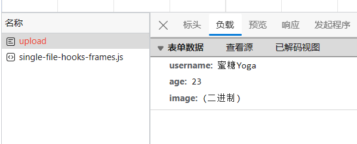

上一小节我们实现了 Tlias 员工的分页条件查询, 其中使用到了 PageHelper, 同时新建了一个 QueryArg 实体用于接收查询参数例如 Page, PageSize 以及其他条件, 我们使用 Page 和 pageSize 初始化 PageHelper 对象, 随后依据姓名性别入职日期等查询条件在xml编写动态SQL 查询满足条件的数据, 但只有在 PageHelper.getResult() 和 PageHelper.getTotal() 函数时才会实际拼接SQL 并执行, 可以从命令行的log信息印证这一点, 这两个函数返回的结果在 Service 层被封装为 PageBean 实体, 随后在 EmpController 中封装为 Result 作为响应结果返回.

这一小节主要完成员工的新增与删除操作, 在新增员工时, 本小节还介绍了依托于阿里云OSS等云服务的文件上传服务.

## 删除员工(可批量)
需要添加的 java 代码, 注释注明了要在哪个类中添加
```java
// EmpController
@DeleteMapping("emps/{ids}")
public Result deleteByIds(@PathVariable List<Integer> ids){
    empService.deleteByIds(ids);
    return Result.success();
}
// EmpService
void deleteByIds(List<Integer> ids);
// EmpServiceImpl
@Override
public void deleteByIds(List<Integer> ids) {
    empMapper.deleteByIds(ids);
}
// EmpMapper
void deleteByIds(List<Integer> ids);
```
添加 for-each sql 语句
```xml
<delete id="deleteByIds">
    delete from emp where id in
    <foreach collection="ids" item="id" open="(" separator=", " close=")">
        #{id}
    </foreach>
</delete>
```
## 新增员工
新增员工的一个比较麻烦的点在于员工头像, 他是一个图片而非文本, 然而, 一个合适的解决方法是存储图片的url, 同时为了图片url可访问, 需要借助于云服务, 例如阿里云OSS. 当然可以存储在本地磁盘, 为了区分各个图片命名, 可以使用一个叫 UUID 的模块, 它生成了随机的无重复的命名. 另外传入图片也是一个上传文件的操作.

首先不考虑图片存储, 先假定它就是一个字符串, 则:
需要添加的 java 代码, 注释注明了要在哪个类中添加
```java
// EmpController
@PostMapping("/emps")
public Result insertEmp(@RequestBody Employee employee){
    empService.insertEmp(employee);
    return Result.success();
}
// EmpService
void insertEmp(Employee employee);
// EmpServiceImpl
@Override
public void insertEmp(Employee employee) {
    employee.setCreateTime(LocalDateTime.now());
    employee.setCreateTime(LocalDateTime.now());
    empMapper.insertEmp(employee);
}
// EmpMapper
void insertEmp(List<Integer> ids);
```
添加 insert sql 语句
```xml
<insert id="insertEmp">
    insert into emp(username, name, gender, image, job, entrydate,
                    dept_id, create_time, update_time)
    VALUES (#{username}, #{name}, #{gender}, #{image}, #{job}, #{entrydate},
            #{deptId}, #{createTime}, #{updateTime})
</insert>
```
使用 Apifox 测试:
```json
{
    "image": "https://web-framework.oss-cn-hangzhou.aliyuncs.com/2022-09-03-07-37-38222.jpg",
    "username": "linpingzhi",
    "name": "林平之",
    "gender": 1,
    "job": 1,
    "entrydate": "2022-09-18",
    "deptId": 1
}
```

## 文件上传
接下来将目光转移到 Test 模块, 这里我们测试文件上传的功能.

文件上传，是指将本地图片、视频、音频等文件上传到服务器，供其他用户浏览或下载的过程。文件上传在项目中应用非常广泛，我们经常发微博、发微信朋友圈都用到了文件上传功能。

一是前端需要有一个表单提交, 该表单包含文件上传的选项:
```html
<!DOCTYPE html>
<html lang="en">
<head>
    <meta charset="UTF-8">
    <title>上传文件</title>
</head>
<body>

    <form action="/upload" method="post" enctype="multipart/form-data">
        姓名: <input type="text" name="username"><br>
        年龄: <input type="text" name="age"><br>
        头像: <input type="file" name="image"><br>
        <input type="submit" value="提交">
    </form>

</body>
</html>
```
需要特别注意的是 enctype 必须是 form-data, 点击打开html文件, 填写表单并点击提交, 弹出 404 页面, 因为还没有写后台程序. 接着打开开发者工具, 点击网络请求, 查看 upload 请求:


接下来可以构建后台程序了, 将该html文件放入 resources 下的 static 目录. 在 contoller 包下新建一个 UploadController, 表单中指明了请求路径和请求方式, 而图中指明了请求的参数, 在后台可以这样接收它:
```java
@RestController
@Slf4j
public class UploadController {
    @PostMapping("/upload")
    public Result uploadFile(String username, Integer age, MultipartFile image){
        log.info("username={}, age={}, image={}", username, age, image);
        return Result.success();
    }
}
```
访问 http://127.0.0.1:8080/upload.html

填写表单提交, 发现返回了 `Result.success()` 定义的json数据, 查看日志, 三个参数均接收正常.

### 将文件存入本地缓存
需要考虑的是, 获取文件名, 文件扩展格式, 以及使用 UUID 来使文件名唯一
```java
public Result uploadFile(String username, Integer age, MultipartFile image) throws IOException {
    log.info("username={}, age={}, image={}", username, age, image);
    String originalFilename = image.getOriginalFilename();
    assert originalFilename != null;
    String fileName = UUID.randomUUID()+originalFilename.substring(originalFilename.lastIndexOf("."));
    image.transferTo(new File("D:/cache/"+fileName));
    return Result.success();
}
```
然而, 针对一些比较大的文件, 程序运行异常, 这是由于默认上传文件大小不超过 1MB , 可以修改配置, 例如 10MB, 在 properties 文件中添加:
```yml
spring.servlet.multipart.max-file-size=10MB
spring.servlet.multipart.max-request-size=100MB
```
分别规定单个文件限制和总上传限制

一些常用的 api:
```java
String getOriginalFilename();   //获取原始文件名
void transferTo(File dest);     //将接收的文件转存到磁盘文件中
long getSize();                 //获取文件的大小，单位：字节
byte[] getBytes();              //获取文件内容的字节数组
InputStream getInputStream();   //获取接收到的文件内容的输入流
```
### 使用阿里云OSS服务
阿里云对象存储OSS（Object Storage Service），是一款海量、安全、低成本、高可靠的云存储服务。使用OSS，您可以通过网络随时存储和调用包括文本、图片、音频和视频等在内的各种文件。

注册阿里云账号, 创建 accessKey, 创建 OSS 项目, 新建bucket. 找到快速入门示例, 查看关于上传文件的代码:
首先需要引入依赖
```xml
<dependency>
    <groupId>com.aliyun.oss</groupId>
    <artifactId>aliyun-sdk-oss</artifactId>
    <version>3.10.2</version>
</dependency>
```
接着是示例代码:
[快速使用OSS Java SDK完成常见操作，例如创建存储空间（Bucket）、上传文件（Object）、下载文件等](https://help.aliyun.com/document_detail/32011.html)
```java
import com.aliyun.oss.ClientException;
import com.aliyun.oss.OSS;
import com.aliyun.oss.OSSClientBuilder;
import com.aliyun.oss.OSSException;
import java.io.ByteArrayInputStream;

public class Demo {

    public static void main(String[] args) throws Exception {
        // Endpoint以华东1（杭州）为例，其它Region请按实际情况填写。
        String endpoint = "https://oss-cn-hangzhou.aliyuncs.com";
        // 强烈建议不要把访问凭证保存到工程代码里，否则可能导致访问凭证泄露，威胁您账号下所有资源的安全。本代码示例以从环境变量中获取访问凭证为例。运行本代码示例之前，请先配置环境变量。
        EnvironmentVariableCredentialsProvider credentialsProvider = CredentialsProviderFactory.newEnvironmentVariableCredentialsProvider();
        // 填写Bucket名称，例如examplebucket。
        String bucketName = "examplebucket";
        // 填写Object完整路径，例如exampledir/exampleobject.txt。Object完整路径中不能包含Bucket名称。
        String objectName = "exampledir/exampleobject.txt";

        // 创建OSSClient实例。
        OSS ossClient = new OSSClientBuilder().build(endpoint, credentialsProvider);

        try {
            String content = "Hello OSS";
            ossClient.putObject(bucketName, objectName, new ByteArrayInputStream(content.getBytes()));
        } catch (OSSException oe) {
            System.out.println("Caught an OSSException, which means your request made it to OSS, "
                    + "but was rejected with an error response for some reason.");
            System.out.println("Error Message:" + oe.getErrorMessage());
            System.out.println("Error Code:" + oe.getErrorCode());
            System.out.println("Request ID:" + oe.getRequestId());
            System.out.println("Host ID:" + oe.getHostId());
        } catch (ClientException ce) {
            System.out.println("Caught an ClientException, which means the client encountered "
                    + "a serious internal problem while trying to communicate with OSS, "
                    + "such as not being able to access the network.");
            System.out.println("Error Message:" + ce.getMessage());
        } finally {
            if (ossClient != null) {
                ossClient.shutdown();
            }
        }
    }
}
```

然而, 尝试了许久环境变量相关操作无法正常获取 ACCESS KEY. 因此最终还是把访问密钥放在了代码中(这样看起来似乎十分不合规范), 在 api 接口中, 上传图片的请求方式为 post, 参数即为上传的图片, 可使用 MultipartFile 接收. 创建一个 contoller 处理该请求, 它接收上传过来的 file stream, 上传到 oss, 接着返回访问路径. 前台收到响应后就知道了 url, 随后在点击确定新建时该url就被封装到请求参数实体的url中, 因此, 你惊讶的发现, **似乎之前的代码根本不需要作改动**

你只需添加单独处理文件上传并返回包含url响应数据的类即可！

具体的, 除了添加 oss 相关依赖, 还需要添加一个 Contoller:
```java
@RestController
@Slf4j
public class UploadController {
    @Autowired
    private OssUploader ossUploader;
    @PostMapping("/upload")
    public Result uploadFile(MultipartFile image) throws IOException {
        String url = ossUploader.uploadToAliOSS(image);
        log.info("文件上传完成,文件访问的url: {}", url);
        return Result.success(url);
    }
}
```
以及一个 `OssUploader` 工具类, 它简单改造了官方示例:
```java
@Component
public class OssUploader {
    public String uploadToAliOSS(MultipartFile file) throws IOException{
        // 1. 配置上传的路径信息和认证信息, 创建上传代理
        OSS ossClient = new OSSClientBuilder().build(
                "https://oss-cn-beijing.aliyuncs.com",
                new DefaultCredentialProvider(
                        "your access key",
                        "your key secret"
                )
        );
        String bucketName = "rainbow-tlias";
        String originalFilename = file.getOriginalFilename();
        assert originalFilename != null;
        String fileName = UUID.randomUUID()+originalFilename.substring(originalFilename.lastIndexOf("."));
        String storePath = "image/"+fileName;
        // 2. 实际完成上传的工作
        try {
            ossClient.putObject(bucketName, storePath, new ByteArrayInputStream(file.getBytes()));
        } catch (OSSException oe) {
            System.out.println("Caught an OSSException, which means your request made it to OSS, "
                    + "but was rejected with an error response for some reason.");
            System.out.println("Error Message:" + oe.getErrorMessage());
            System.out.println("Error Code:" + oe.getErrorCode());
            System.out.println("Request ID:" + oe.getRequestId());
            System.out.println("Host ID:" + oe.getHostId());
        } catch (ClientException ce) {
            System.out.println("Caught an ClientException, which means the client encountered "
                    + "a serious internal problem while trying to communicate with OSS, "
                    + "such as not being able to access the network.");
            System.out.println("Error Message:" + ce.getMessage());
        } finally {
            if (ossClient != null) {
                ossClient.shutdown();
            }
        }
        // 3. 返回上传后的文件资源路径, 该资源全局可见
        String bucketUrl = "https://rainbow-tlias.oss-cn-beijing.aliyuncs.com/";
        return bucketUrl + storePath;
    }
}
```
那么, 在添加上述文件后, 在新增员工时, 图片就可以正常显示了.

## 附录
### 更新员工信息
先写依据员工id返回员工信息的接口:
```java
// EmpController
@getEmpById("emps/{ids}")
public Result getEmpById(@PathVariable Integer id){
    Employee employee = empService.getEmpById(id);
    return Result.success(employee);
}
// EmpService
Employee getEmpById(Integer id);
// EmpServiceImpl
@Override
public Employee getEmpById(Integer id) {
    return empMapper.getEmpById(id);
}
// EmpMapper
Employee getEmpById(Integer id);
```
添加 select* sql 语句
```xml
<select id="getEmpById" resultType="com.example.mytlias.pojo.Employee">
    select * from emp where id=#{id}
</select>
```
该接口用于新增员工页面员工信息的回显

接下来就是更新员工信息:
```java
// EmpController
@PutMapping("/emps")
public Result updateEmp(@RequestBody Employee employee){
    log.info("更新 {} 的员工信息", employee);
    empService.updateEmp(employee);
    return Result.success();
}
// EmpService
void updateEmp(Employee employee);
// EmpServiceImpl
@Override
public void updateEmp(Employee employee) {
    employee.setUpdateTime(LocalDateTime.now());
    empMapper.updateEmp(employee);
}
// EmpMapper
void updateEmp(Employee employee);
```
如下为sql:
```xml
<update id="updateEmp">
    update emp set username=#{username}, name=#{name}, gender=#{gender},
                    image=#{image}, job=#{job}, entrydate=#{entrydate},
                    dept_id=#{deptId}, update_time=#{updateTime}
    where id = #{id}
</update>
```

那么到此为止, tlias 员工信息管理系统的基本功能就完全实现了.

