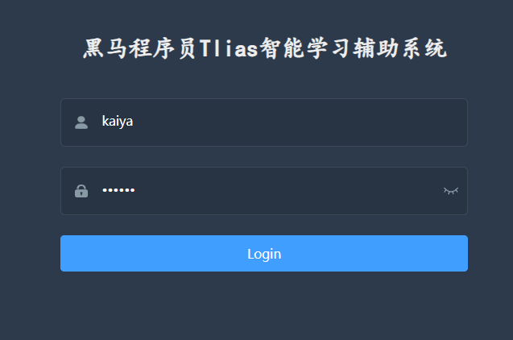
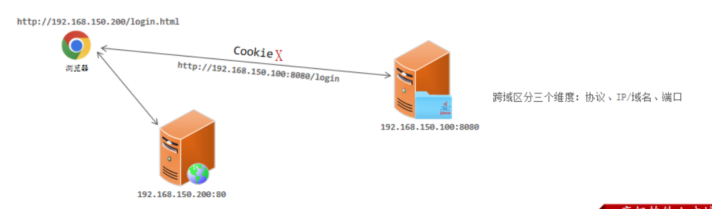
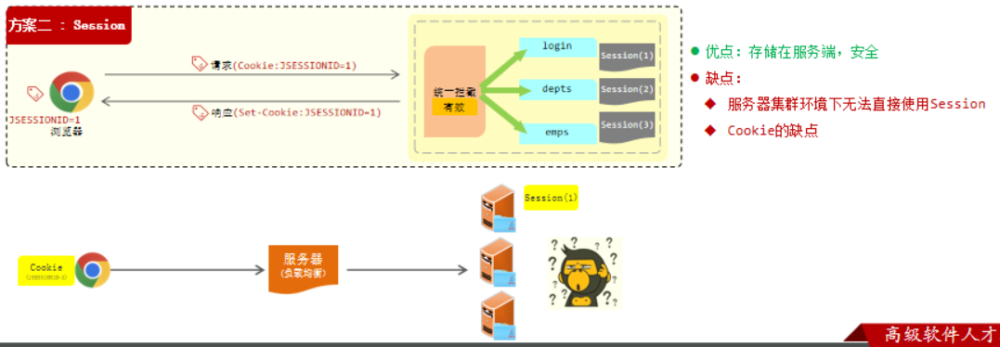
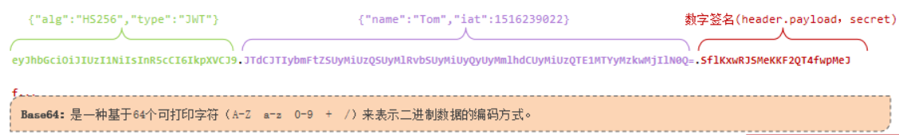
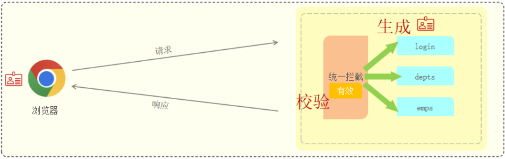

在未登录情况下，我们也可以直接访问部门管理、员工管理等功能。因此需要登录认证功能。

一是登录功能, 也就是在登录界面输入账号密码，经过数据库校验(也即检查账号密码是不是存在的)返回查询结果, 那么前台根据查询结果决定是否跳转到后台管理页面.
第二个是认证功能, 这也是较为核心的功能, 也即需要检查用户的登录状态, 未登录时如果直接访问后台管理页面的url, 应当重定向回登录页面.

### 登录(SQL查询)
如图, 在登陆页面, 填入账号密码:

后台会进行校验, 以决定是否跳转到后台页面.
新建一个 `LoginController` 类, 添加请求处理函数, 以及相应的底层处理函数:
```java
// LoginController
@Slf4j
@RestController
public class LoginController {
    @Autowired
    private EmpService empService;
    @PostMapping("/login")
    public Result login(@RequestBody Employee employee){
        log.info("Login info: usr={}, pwd={}", employee.getUsername(), employee.getPassword());
        boolean isOk = empService.checkIn(employee);
        if (isOk) return Result.success();
        else return Result.error();
    }
}
// EmpService
boolean checkIn(Employee employee);
// EmpServiceImpl
@Override
public boolean checkIn(Employee employee) {
    String username = employee.getUsername();
    String password = employee.getPassword();
    int cnt = empMapper.getUsrByNamePwd(username, password);
    return cnt > 0;
}
// EmpMapper
int  getUsrByNamePwd(String username,  String password);
// EmpMapper.xml
<select id="getUsrByNamePwd" resultType="java.lang.Integer">
    select count(*) from emp where username=#{username} and password=#{password}
</select>
```

## 校验
在未登录情况下，我们也可以直接访问部门管理、员工管理等功能. http请求本身是无状态的, 对于每次http请求, 我们需要确认该次请求的状态(是否特定于用户, 也即是否已登录).

一个自然的想法是: 在客户浏览器首次登录时, 服务器端存储客户的一个登录标记, 此后对于每一个请求, 需要检查请求携带的信息后才会决定是否放行, 这样的维护浏览器状态的技术被称为会话技术.

**会话**: 用户打开浏览器，访问web服务器的资源，会话建立，直到有一方断开连接，会话结束。在一次会话中可以包含多次请求和响应。
**会话跟踪**: 一种维护浏览器状态的方法，**服务器需要识别多次请求是否来自于同一浏览器，以便在同一次会话的多次请求间共享数据**。
会话跟踪方案：
**客户端**会话跟踪技术: **Cookie**
**服务端**会话跟踪技术: **Session**
**令牌技术**

### Cookie
客户端会话技术, 也即验证信息存储在客户端, 在用户进行登录操作后, 服务器端会设置一个cookie, 它其中存储了一些键值对, 例如用户名, 用户ID等, 接着在返回响应中包含 cookie, 同时浏览器自动将响应头的 cookie(Set-cookie) 存储到本地, 随后浏览器每次请求时其头部都包含一个 cookie 字段.
如下演示了cookie的特性:
```java
/**
 * to demonstrate how the cookie works
 */
@RestController
public class CookieController {
    @GetMapping("/sc")
    public Result setCookie(HttpServletResponse response){
        // 在响应中添加 cookie 字段值
        response.addCookie(new Cookie("username", "rainbow"));
        return Result.success();
    }
    @GetMapping("/gc")
    public Result getCookie(HttpServletRequest request){
        // 浏览器发起请求会自动携带 cookie
        Cookie[] cookies = request.getCookies();
        for(Cookie c: cookies){
            if(c.getName().equals("username"))
                System.out.println("username: "+c.getValue());
        }
        return Result.success();
    }
}
```
首先, 在浏览器访问`http://localhost:8080/sc`(客户端发起请求), 打开开发者工具, 按下 Ctrl+R, 随后电极 sc 响应, 查看响应头(服务端返回响应, 其中包含 cookie字段), 其中的就包含一个 `Set-Cookie: username=rainbow`, 再看 Application, 其中的 cookie 一栏就存储了 `username=rainbow` (说明客户端浏览器将cookie数据存在了本地)

随后发起请求 `http://localhost:8080/gc` (客户端再次发起请求), 此时可以看到请求头中携带了cookie信息(`cookie: username=rainbow`)

优点：HTTP协议中支持的技术
缺点：
 移动端APP无法使用Cookie
 不安全，用户可以自己禁用Cookie
 Cookie不能跨域

**跨域**

意思是浏览器访问的页面地址(例如登录页面: 前端服务器)与发送请求的地址(例如点击登录后需要访问的是后端服务器的资源), 此时后端服务器不可以在返回的请求中设置cookie

### Session
Session 数据存储在服务端, 因此优点是安全, 同时它底层还是封装的 Cookie 技术, 因此 Cookie 的缺点 Session 也都有, 如如所示, 浏览器发出请求后服务器端建立会话, 并赋予一个会话ID, 随后在 cookie 携带 ID 字段, 同样的在后面浏览器的各次请求也都会携带会话ID.

考虑负载均衡服务器集群的情况, 此时实际用于处理请求的服务器是不确定的, 但 Session 数据又要存储在服务端, 因此无法直接使用 Session.

### JWT令牌技术
全称：`JSON  Web  Token` （https://jwt.io/）
定义了一种**简洁的、自包含的**格式，用于在通信双方以json数据格式安全的传输信息。由于**数字签名的存在**，这些信息是可靠的。
组成:
第一部分:Header(头)，记录令牌类型、签名算法等。例如: `{"alg":"HS256","type":"JWT}`
第二部分: Payload(有效载荷)，携带一些自定义信息、默认信息等。例如: `{"id":"1","username":"Tom"}`
第三部分: Signature(签名)，防止Token被篡改、确保安全性。将header、payload，并加入指定秘钥，通过指定签名算法计算而来。

jwt 一般形式:

它把json数据编码为了一个带两个点的长字符串, 这样的扁平字符串可以存储在任何位置, 克服了前两者的缺陷.

场景：登录认证。
登录成功后，生成令牌
后续每个请求，都要携带JWT令牌，系统在每次请求处理之前，先校验令牌，通过后，再处理


**使用JWT令牌**

引入 jjwt 依赖, 
```xml
<dependency>
    <groupId>io.jsonwebtoken</groupId>
    <artifactId>jjwt</artifactId>
    <version>0.9.1</version>
</dependency>
```
生成令牌:
```java
void jwtGenerate() {
    // 1. payload
    Map<String, Object> payload = new HashMap<>();
    payload.put("Mike", 2);
    payload.put("Silicon", "important");
    // 2. secret
    String secret = "rainbow";
    // 2. generate jwt
    String jwt = Jwts.builder()
            .setClaims(payload)         // 添加载荷
            .signWith(SignatureAlgorithm.HS256, secret)     // 签名算法以及密钥
            .setExpiration(new Date(System.currentTimeMillis()+3*60*1000))    // 有效时间, 例如这里是 3min
            .compact();
    System.out.println(jwt);
}
```
JWT校验时使用的签名秘钥，必须和生成JWT令牌时使用的秘钥是配套的。
如果JWT令牌解析校验时报错，则说明 JWT令牌被篡改 或 失效了，令牌非法。
```java
void jwtParse(){
    String secret = "rainbow";
    // 刚刚生成的令牌, 注意有效期 3min
    String jwt = "eyJhbGciOiJIUzI1NiJ9." +
            "eyJNaWtlIjoyLCJTaWxpY29uIjoiaW1wb3J0YW50IiwiZXhwIjoxNjkwNjMzOTIxfQ." +
            "ka47GykiAGfRHUrQA6vmXsqdVqI5sBovJa9QInFYErA";
    Claims claims = Jwts.parser()
            .setSigningKey(secret)
            .parseClaimsJws(jwt)
            .getBody();
    System.out.println(claims);
    // {Mike=2, Silicon=important, exp=1690633921}
    System.out.println(new Date(1690633921));
}
```

### 登录校验
编写一个 jwt 工具类, 它包含将认证信息编码为 jwt 字串以及解码 jwt 字符串到 认证信息的两个方法
```java
public class JwtUtils {
    private static final String secret = "rainbow";     // sign secret
    private static final long expire = 12*60*60*1000;   // 12 hours
    public static String jwtGenerate(Map<String, Object> payload) {
        return Jwts.builder()
                .setClaims(payload)
                .signWith(SignatureAlgorithm.HS256, secret)
                .setExpiration(new Date(System.currentTimeMillis()+expire))
                .compact();
    }
    public static Claims jwtParse(String jwt){
        return Jwts.parser()
                .setSigningKey(secret)
                .parseClaimsJws(jwt)
                .getBody();
    }
}
```
将登录的一系列代码改为:
```java
// login controller
@Slf4j
@RestController
public class LoginController {
    @Autowired
    private EmpService empService;
    @PostMapping("/login")
    public Result login(@RequestBody Employee employee){
        log.info("Login info: usr={}, pwd={}", employee.getUsername(), employee.getPassword());
        Employee e = empService.checkIn(employee);
        if (e != null) {
            // 生成一个 JWT令牌 作为响应结果
            Map<String, Object> payload = new HashMap<>();
            payload.put("id", e.getId());
            payload.put("name", e.getName());
            payload.put("username", e.getUsername());
            String jwt = JwtUtils.jwtGenerate(payload);
            return Result.success(jwt);
        } else return Result.error("用户名或密码错误");
    }
}
// EmpService
Employee checkIn(Employee employee);
// EmpServiceImpl
@Override
public Employee checkIn(Employee employee) {
    String username = employee.getUsername();
    String password = employee.getPassword();
    return empMapper.getUsrByNamePwd(username, password);
}
// EmpMapper
Employee  getUsrByNamePwd(String username,  String password);
```
sql 语句
```xml
<select id="getUsrByNamePwd" resultType="com.example.mytlias.pojo.Employee">
    select * from emp where username=#{username} and password=#{password}
</select>
```
此时重新启动项目, 再进行登录操作, 会发现响应数据中就有了 jwt 令牌。
