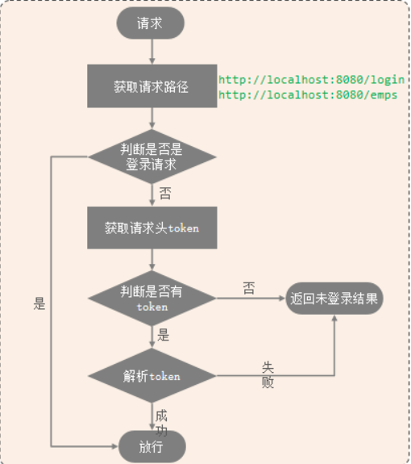
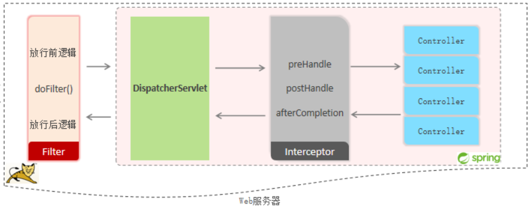

接下来就是有关请求拦截和放行相关的内容了, 在上一小节, 我们为登录请求添加了用户验证功能, 随后讨论了三种常见的会话跟踪技术, 它们都试图记住用户的登录状态.
其一是 cookie, 在登录验证的情景中, 用户首次登录后服务器会把用户认证信息存储到 cookie, 在响应头中设置 cookie, 随后客户端每次发送请求都会携带这一验证信息. 这是一种在客户端存储用户验证信息的技术
其二是 session, 在登录验证的情景中, 用户首次登录后服务器会为该用户生成一个会话, 并在响应头中包含会话ID, 随后客户端每次发送请求都会携带这一验证信息. 这是一种在服务端存储用户验证信息的技术
其三是 jwt, 它工作流程与前两者类似, 但它把用户信息以json字符串的形式通过base64编码并添加认证和超时信息, 最终形式是一个简单的长字符串. 可以存储在任何地方

jwt 是简单安全高效通用的方式.

然而, 我们不可能在每个请求处理方法中都添加一段验证的代码. 因此, 一种好的方式是将请求先统一拦截, 统一验证, 再决定允许哪些可以放行(也即允许访问对应资源). Filter 和 Interceptor 都实现了这样的功能. 值得注意的是, Filter 是 JavaWeb 中的 Servlet 组件, 而 Interceptor 是 SpringBoot 中的组件.

### 过滤器 Filter
概念：Filter 过滤器，是 JavaWeb 三大组件(Servlet、Filter、Listener)之一。
过滤器可以把对资源的请求拦截下来，从而实现一些特殊的功能。
过滤器一般完成一些通用的操作，比如：登录校验、统一编码处理、敏感字符处理等。

**快速入门**
**定义 Filter**: 定义一个类, 实现 Filter 接口，并重写其所有方法.
**配置 Filter**: Filter类上加 @WebFilter 注解，配置拦截资源的路径。引导类上加 `@ServletComponentScan` 开启Servlet组件支持.

其核心方法是 `doFilter()`
```java
@Override
public void doFilter(ServletRequest req, ServletResponse res, FilterChain c)
throws IOException, ServletException {
    // 1. 放行前逻辑
    // some code
    // 2. 放行
    c.doFilter(req, res);
    // 3. 放行后逻辑
    // some code
}
```
在第二步, 实际放行时会转到相应的请求处理方法执行后续操作, 在请求处理方法返回后会回到 doFilter 函数, 并执行放行后逻辑.

**Filter 拦截路径**
执行流程: 请求 --> 放行前逻辑 --> 放行 --> 资源 --> 放行后逻辑
拦截路径: 
`/login`
`/depts/*`
`/*`

**Filter 过滤器链**
一个web应用中，配置了多个过滤器，就形成了一个过滤器链

### 使用 Filter 的统一拦截
回到 jwt 验证, 在登录请求中, 如果成功了会下发令牌, 随后每次(非登录)请求都会携带令牌, 此时这些请求会首先来到`doFilter`方法进行处理. 因而 doFilter 可以这样进行:
```
1. 获取请求的资源路径(url)
2. 如果包含 login, 则直接放行
3. 否则尝试获取 token
4. 没有 token, 说明还未登录, 不予放行, 在响应中写入失败信息
5. 有token字段, 则尝试解析 token
6. 解析 token 失败, 不予放行, 在响应中写入失败信息
7. 解析成功, 则直接放行
8. 结束
```


实际添加的代码:
```java
@Slf4j
@WebFilter("/*")
public class LoginFilter implements Filter {
    @Override
    public void doFilter(ServletRequest servletRequest, ServletResponse servletResponse, FilterChain filterChain) throws IOException, ServletException {
        // 1. 获取请求的资源路径(url)
        HttpServletRequest req = (HttpServletRequest) servletRequest;
        HttpServletResponse res = (HttpServletResponse) servletResponse;
        String url = req.getRequestURL().toString();
        // 1-1. 提前准备失败时需要写入的信息, 注意必须是 json 格式的字符串
        //      这里引入了 alibaba 的依赖: fastjson, 同时返回信息由接口文档确定
        String failure = JSONObject.toJSONString(Result.error("NOT_LOGIN"));
        // 2. 如果包含 login, 则直接放行
        if(url.contains("login")){
            log.info("login operation, access allowed");
            filterChain.doFilter(servletRequest, servletResponse);  // 此即为放行操作
            return;
        }else{
            // 3. 否则尝试获取 token
            String jwt = req.getHeader("token");
            if (StringUtils.isEmpty(jwt)){
                // 4. 没有 token, 说明还未登录, 不予放行
                log.info("no token in request header, access not allowed");
                res.getWriter().write(failure);     // 向响应数据写入失败信息
                return;
            }else{
                // 5. 有token字段, 则尝试解析 token
                try{
                    Claims body = JwtUtils.jwtParse(jwt);
                }catch (Exception e){
                    log.error("exception: "+e.getClass().getSimpleName());
                    log.info("token invalid, you may login again");
                    res.getWriter().write(failure);
                    return;
                }
            }
        }
        // 6. 请求携带了有效token, 则放行
        filterChain.doFilter(servletRequest, servletResponse);
        log.info("The token from this request is valid, access allowed");
    }
}
```

### 拦截器 Interceptor
概念：是一种动态拦截方法调用的机制，类似于过滤器。Spring框架中提供的，用来动态拦截控制器方法的执行。
作用：拦截请求，在指定的方法调用前后，根据业务需要执行预先设定的代码。

**Interceptor 快速入门**
定义拦截器, 实现 `HandlerInterceptor` 接口, 重写其所有方法, 并交给IOC容器管理。
注册拦截器, 实现 `WebMvcConfigurer`, 定义拦截器, 为其注册路径支持

语法稍复杂, 但封装的更好, 使用起来更优雅, 可读性更好

**Interceptor 拦截路径**
拦截器可以根据需求，配置不同的拦截路径:
拦截路径 | 含义 | 举例
:-|:-|:-|
/*|	一级路径|	能匹配/depts，/emps，/login，不能匹配 /depts/1
/**|	任意级路径|	能匹配/depts，/depts/1，/depts/1/2
/depts/*|	/depts下的一级路径|	能匹配/depts/1，不能匹配/depts/1/2，/depts
/depts/**|	/depts下的任意级路径|	能匹配/depts，/depts/1，/depts/1/2，不能匹配/emps/1

**Interceptor Filter**


使用 Interceptor 完成拦截与验证的需求
定义一个拦截器类
```java
package com.example.mytlias.interceptor;
@Slf4j
@Component
public class LoginCheckInterceptor implements HandlerInterceptor {
    @Override   // 目标资源方法执行前执行, 返回true表示放行, 否则不放行
    public boolean preHandle(HttpServletRequest request, HttpServletResponse response, Object handler) throws Exception {
        // 在 WebMvcConfigurer 中添加了这一 interceptor 并配置了拦截路径后, 那些需要拦截的请求会来到这里
        String url = request.getRequestURL().toString();
        String failure = JSONObject.toJSONString(Result.error("NOT_LOGIN"));
        if(url.contains("login")){
            log.info("login operation, access allowed");
            return true;
        }else{
            String jwt = request.getHeader("token");
            if (StringUtils.isEmpty(jwt)){
                log.info("no token in request header, access not allowed");
                response.getWriter().write(failure);     // 向响应数据写入失败信息
                return false;
            }else{
                try{
                    Claims body = JwtUtils.jwtParse(jwt);
                }catch (Exception e){
                    log.error("exception: "+e.getClass().getSimpleName());
                    log.info("token invalid, you may login again");
                    response.getWriter().write(failure);
                    return false;
                }
            }
        }
        log.info("The token from this request is valid, access allowed");
        return true;
    }

    @Override   // 目标资源方法执行后执行
    public void postHandle(HttpServletRequest request, HttpServletResponse response, Object handler, ModelAndView modelAndView) throws Exception {
        HandlerInterceptor.super.postHandle(request, response, handler, modelAndView);
    }

    @Override   // 视图渲染完毕后执行, 最后执行
    public void afterCompletion(HttpServletRequest request, HttpServletResponse response, Object handler, Exception ex) throws Exception {
        HandlerInterceptor.super.afterCompletion(request, response, handler, ex);
    }
}

```
整体上和 filter 差不多, 但这里没有强转, 变量名也更简洁.
注册这个拦截器
```java
package com.example.mytlias.config;
@Configuration
public class LoginCheckConfig implements WebMvcConfigurer {
    @Autowired
    private LoginCheckInterceptor interceptor;
    @Override
    public void addInterceptors(InterceptorRegistry registry) {
        // 拦截除了 login 以外的所有请求
        registry.addInterceptor(interceptor).addPathPatterns("/**").excludePathPatterns("/login");
    }
}
```
随后测试它, 注意此时先注释掉 Filter. 


