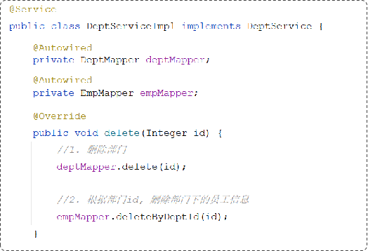

在程序开发运行的过程中随时随处都可能发生异常, 例如进行数据库操作时, 删除不存在的数据, 或者插入了重复数据, 以及例如文件读写、网络访问、令牌解析等等地方都可能发生异常. 另一个可以想到的是, 未处理的异常最终都会被抛出到 controller 控制层, 可以仅在控制层进行异常处理. 然而, 一种更好的处理方法是将异常统一进行处理, 这被称为全局异常处理器, 它将作用于每一个可能抛出异常的方法, 这样的不修改原方法而是设置一个对这些具有相似行为的方法群做出对这一行为产生响应的处理类(方法)的思想被称为面向切面编程(**`aspect oreiented programming`**).

另外, 异常可能导致数据的不一致性, 例如在需要连续完成的动作间产生了异常, 除了需要进行异常处理并产生错误报告外, 还需要事务特性的支持, 它需要维护代码块执行的原子性.


## 异常处理
使用全局的异常处理器.
主要是两个注解
在类上标注 `@RestControllerAdvice`
在类中的方法上标注 `@ExceptionHandler`

```Java
@Slf4j
@RestControllerAdvice
public class GlobalExceptionHandler {
    @ExceptionHandler(Exception.class)
    public Result hd(Exception e){
        log.error(e.toString());
        return Result.error("Operation failed");
    }
}
```

## 异常处理
先看一个案例, `解散部门：删除部门，同时删除该部门下的员工`

即使程序运行抛出了异常，部门依然删除了，但是部门下的员工却没有删除，造成了数据的不一致。

可以使用 Spring 的事务回滚机制
注解：`@Transactional`
位置：业务（service）层的方法上、类上、接口上
作用：将当前方法交给spring进行事务管理，方法执行前，开启事务；成功执行完毕，提交事务；出现异常，回滚事务

为了更好的查看事务处理的过程, 可以开启 **事务管理日志**
在 yaml 配置文件中:
```yml
logging:
  level:
    org.springframework.jdbc.support.JdbcTransactionManager: debug
```

完善 `deleteDeptByID`
```java
// dept service interface
@Transactional
void deleteDeptByID(Integer id);
// dept service implementation
@Override
public void deleteDeptByID(Integer id) {
    // 还需要依据部门id删除部门员工
    deptMapper.deleteDeptByID(id);
    int i = 1 / 0;  // a runtime exception occurred
    deptMapper.deleteEmpByDept(id);
}
// dept mapper
@Delete("delete from emp where dept_id=#{id}")
void deleteEmpByDept(Integer id);
```
我们发现事务的确进行了回滚, 删除不成功, 没有出现人员保留但部门已删除的情况.
但如果是这样?
```java
@Override
public void deleteDeptByID(Integer id) {
    // 还需要依据部门id删除部门员工
    deptMapper.deleteDeptByID(id);
    if(true){
        throw Exception("程序异常")
    }
    deptMapper.deleteEmpByDept(id);
}
```
由于 Spring 默认运行时异常才会回滚, 因此此时会出现数据不一致的情况. 这里可以指定需要回滚时的异常类型:
**`rollbackFor`**
例如:
`@Transactional(rollbackFor = Exception.class)`
就表示在指定的事务代码块中, 抛出了任何异常, 事务均会回滚.

### 事务的传播
**`propagation`**, 事务传播行为：指的就是当一个事务方法被另一个事务方法调用时，这个事务方法应该如何进行事务控制。

考虑这样的一个场景: 函数a调用了另一个函数b, a和b都具备事务特性(表现为都有 `@Transactional` 注解), 那么很自然的想到, a 和 b 是共用一个事务呢 还是说 b 需要新开一个事务? 它们的区别是, 在共用事务的情景下, a 中代码若抛出了异常, b中的所有操作也会一起撤销, 同理, b中代码出现异常也可能影响a的执行.
而在后一种情景, 两个事务独立进行, a 中的异常不会影响 b 的进行(只要事务b开启了)

属性值|	含义
:-|:-|
REQUIRED|	【默认值】需要事务，有则加入，无则创建新事务
REQUIRES_NEW|	需要新事务，无论有无，总是创建新事务
SUPPORTS|	支持事务，有则加入，无则在无事务状态中运行
NOT_SUPPORTED|	不支持事务，在无事务状态下运行,如果当前存在已有事务,则挂起当前事务
MANDATORY|	必须有事务，否则抛异常
NEVER|	必须没事务，否则抛异常

解散部门时，记录操作日志
需求：解散部门时，无论是成功还是失败，都要记录操作日志。
步骤：
	①. 解散部门：删除部门、删除部门下的员工
	②. 记录日志到数据库表中


一般的, 
`REQUIRED` ：大部分情况下都是用该传播行为即可。
`REQUIRES_NEW` ：当我们不希望事务之间相互影响时，可以使用该传播行为。比如：下订单前需要记录日志，不论订单保存成功与否，都需要保证日志记录能够记录成功。
